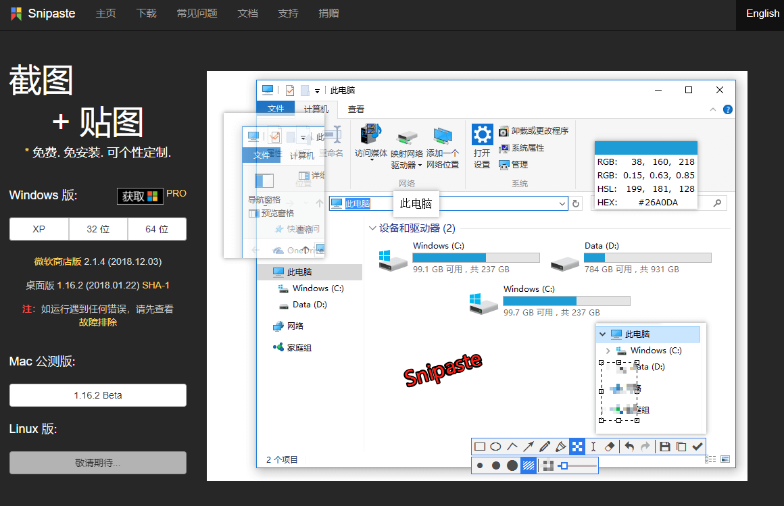

# atom-markdown-image-paste

## 使用方法

* 截图工具截图，推荐 `Snipaste`
* Atom 打开markdown 文件，
  - 方式一：**另起空白行**，直接“**Ctrl+c**”粘贴
    - 优点：简单干脆，`大懒人模式`
    - 缺点：文件名随机生成，量多不好删改
  - 方式二：键入图片文件名，**选中文件名区域**，“**Shift+Ctrl+c**”粘贴
    - 优点：可以命名图片
    - 缺点：每次都要手动命名，多按一个键，操作失误只能手动删改

## 注意

1. 方式一，最好另起空白行粘贴，直接粘贴会删除当前行内容
2. 方式一，图片文件名，直接随机生成了的，如果要每个粘贴都命名太麻烦了哟，这是个人习惯
3. 方式二键入图片文件名将作为图片存放名，**必须要选中**再按快捷键。
3. 默认存放在当前工作路径的`image`文件夹下，可在设置中修改存放路径
4. 存放路径只限本地，再传 GitHub 之类仓库托管，没有传图床的习惯

## Snipaste 截图神器推荐

`没错，我懒懒的搞了别人动图过来~~`

- <https://zh.snipaste.com>
- <https://www.52pojie.cn/thread-690279-1-1.html>

## 改进

1. 动图，复制动图粘贴会转PNG格式且变成静图

## 设置

## 参考

- <https://github.com/nmecad/markdown-img-paste>
- <https://github.com/cocoakekeyu/markdown-img-paste>
